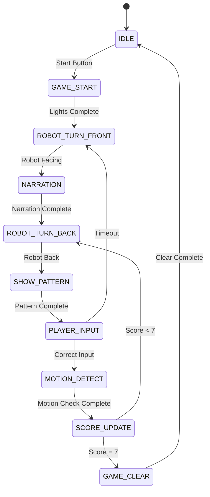

# 무궁화 게임 시스템 설계 문서

## 개요

무궁화 게임 시스템은 Arduino Mega 2560(Master)와 Arduino Nano(Slave) 두 개의 마이크로컨트롤러를 사용하여 구현되는 인터랙티브 게임 시스템입니다. 시리얼 통신을 통해 두 보드가 협력하여 복잡한 게임 로직을 처리합니다.

## 아키텍처

### 시스템 구조도

```
┌─────────────────────────────────────────────────────────────┐
│                    MASTER BOARD (Arduino Mega)              │
│  ┌─────────────────┐  ┌─────────────────┐  ┌──────────────┐ │
│  │   Game Logic    │  │  Audio Control  │  │ LED Control  │ │
│  │   & Scoring     │  │   (DFPlayer)    │  │ & PIR Sensor │ │
│  └─────────────────┘  └─────────────────┘  └──────────────┘ │
└─────────────────────────┬───────────────────────────────────┘
                          │ Serial Communication
┌─────────────────────────┴───────────────────────────────────┐
│                    SLAVE BOARD (Arduino Nano)               │
│  ┌─────────────────┐  ┌─────────────────┐  ┌──────────────┐ │
│  │  Motor Control  │  │  Input Handler  │  │ Effect Audio │ │
│  │  (Robot Head/   │  │  (Floor Pads)   │  │ (DFPlayer)   │ │
│  │   Body)         │  │                 │  │              │ │
│  └─────────────────┘  └─────────────────┘  └──────────────┘ │
└─────────────────────────────────────────────────────────────┘
```

### 역할 분담

**Master Board (Arduino Mega 2560)**
- 게임 상태 관리 및 메인 로직 처리
- 점수 계산 및 레벨 관리
- PIR 센서를 통한 동작 감지
- 점수 LED, 경광등, 이펙트 LED 제어
- 천정 조명 제어
- 내레이션 및 BGM 재생
- EM-Lock 제어

**Slave Board (Arduino Nano)**
- 로봇 Head/Body 모터 제어
- 바닥 발판 입력 처리
- 문제 제시 LED 제어
- 효과음 재생
- 진동 센서 모니터링

## 컴포넌트 및 인터페이스

### Master Board 하드웨어 구성

#### 입력 장치
- **PIR 센서 4개**: 동작 감지 (drA_in1~4, drB_in1~4, drC_in1~4, drD_in1~4)

#### 출력 장치
- **천정 조명 4개**: 12V LED (OUT0~3: 핀 4~7)
- **경광등 2개**: 12V LED, 릴레이 제어 (relSig1~2)
- **이펙트 LED 6개**: 12V LED, 릴레이 제어 (relSig3~8)
- **EM-Lock**: 게임 클리어 시 작동 (OUT4~7: 핀 8~11)

#### 통신 및 오디오
- **DFPlayer Mini**: 내레이션/BGM 재생 (DFTX: 핀 2, DFRX: 핀 3)
- **시리얼 통신**: Slave와의 통신 (Hardware Serial 사용)

### Slave Board 하드웨어 구성

#### 입력 장치
- **바닥 발판 4개**: 진동 센서를 통한 발판 감지 (Analog0~3: A0~A3, 아날로그 입력)
- **리미트 스위치 2개**: 로봇 Head/Body 위치 감지 (MCP23017 확장)

#### 출력 장치
- **로봇 모터 2개**: Head/Body 회전용 12V DC 모터 (L298N 드라이버)
- **문제 제시 LED 4개**: 12V LED (MCP23017 확장을 통한 제어)
- **점수 LED 6개**: 5V LED (MCP23017 확장을 통한 제어)

#### 통신 및 오디오
- **DFPlayer Mini**: 효과음 재생 (DFR_RX: 핀 2, DFR_TX: 핀 3)
- **시리얼 통신**: Master와의 통신 (Hardware Serial 사용)
- **I2C 통신**: MCP23017 확장 칩 제어 (SDA: A4, SCL: A5)

## 데이터 모델

### 게임 상태 구조체
```cpp
struct GameState {
  uint8_t currentLevel;      // 현재 레벨 (1-11)
  uint8_t currentScore;      // 현재 점수 (0-7)
  uint8_t gamePhase;         // 게임 단계
  bool isGameActive;         // 게임 활성 상태
  bool isRobotFacing;        // 로봇이 정면을 보고 있는지
  unsigned long phaseTimer;  // 단계별 타이머
};
```

### LED 패턴 구조체
```cpp
struct LEDPattern {
  uint8_t sequence[4];       // 문제 제시 LED 점멸 순서 (4개)
  uint8_t length;            // 패턴 길이 (1-4)
  uint16_t interval;         // 점멸 간격 (ms)
};
```

### 통신 메시지 구조체
```cpp
struct SerialMessage {
  uint8_t command;           // 명령어 코드
  uint8_t data1;             // 데이터 1
  uint8_t data2;             // 데이터 2
  uint8_t checksum;          // 체크섬
};
```

### 이펙트 LED 패턴 구조체
```cpp
enum EffectPattern {
  SUCCESS_PATTERN = 1,       // 정답 입력시
  ERROR_PATTERN = 2,         // 오답 입력시
  LEVEL_UP_PATTERN = 3,      // 레벨 상승시
  GAME_START_PATTERN = 4,    // 게임 시작시
  GAME_CLEAR_PATTERN = 5,    // 게임 클리어시
  TENSION_PATTERN = 6        // 동작감지 중
};

struct EffectStep {
  uint8_t ledMask;           // LED 점등 마스크 (비트별 제어)
  uint16_t duration;         // 지속 시간 (ms)
  bool isOn;                 // LED 상태 (ON/OFF만 가능)
};

struct EffectSequence {
  EffectStep steps[10];      // 최대 10단계
  uint8_t stepCount;         // 실제 단계 수
  uint8_t repeatCount;       // 반복 횟수
  bool isLooping;            // 무한 반복 여부
};
```

## 소프트웨어 아키텍처

### 상태 머신 설계



### 주요 함수 설계

#### Master Board 핵심 함수
```cpp
// 게임 상태 관리
void updateGameState();
void handleGamePhase();

// LED 제어
void controlCeilingLights(uint8_t pattern);    // 12V LED 제어
void playEffectLED(EffectPattern pattern);     // 이펙트 LED 패턴 재생
void updateEffectLEDs();                       // 이펙트 LED 상태 업데이트
void stopEffectLED();                          // 이펙트 LED 정지

// 센서 처리
bool checkMotionSensors();
void processMotionDetection();

// 통신
void sendCommandToSlave(uint8_t cmd, uint8_t data1, uint8_t data2);
bool receiveFromSlave(SerialMessage* msg);

// 오디오
void playAudio(uint8_t track);              // 내레이션 및 BGM 재생
```

#### Slave Board 핵심 함수
```cpp
// 모터 제어
void rotateRobotHead(bool toFront);
void rotateRobotBody(bool toFront);
void stopAllMotors();
void applyMotorBrake();

// 입력 처리
uint8_t detectFloorPadPress();              // 진동 센서를 통한 발판 감지
uint16_t readVibrationSensors();            // 아날로그 핀에서 진동 센서 값 읽기
bool checkLimitSwitches();                  // MCP23017을 통한 리미트 스위치 확인
void handleVibrationDebounce();             // 진동 센서 디바운싱 처리

// LED 제어
void showLEDPattern(LEDPattern pattern);           // 문제 제시 LED 패턴 표시
void controlProblemLEDs(uint8_t ledIndex, bool state);  // 개별 문제 LED 제어 (MCP23017)
void updateScoreLEDs(uint8_t score);               // 점수 LED 제어 (MCP23017)

// 통신
void processSerialCommand();
void sendResponseToMaster(uint8_t response);

// 오디오
void playEffectSound(uint8_t sound);
```

## 통신 프로토콜

### 명령어 체계
```cpp
// Master → Slave 명령어
#define CMD_ROBOT_FRONT     0x10
#define CMD_ROBOT_BACK      0x11
#define CMD_SHOW_PATTERN    0x20
#define CMD_PLAY_EFFECT     0x30
#define CMD_STOP_ALL        0xFF

// Slave → Master 응답
#define RESP_ROBOT_READY    0x01
#define RESP_PATTERN_DONE   0x02
#define RESP_INPUT_CORRECT  0x03
#define RESP_INPUT_WRONG    0x04
#define RESP_LIMIT_REACHED  0x05
```

### 메시지 형식
```
[HEADER][COMMAND][DATA1][DATA2][CHECKSUM]
- HEADER: 0xAA (고정)
- COMMAND: 명령어 코드
- DATA1, DATA2: 추가 데이터
- CHECKSUM: XOR 체크섬
```

## 에러 처리

### 하드웨어 안전장치
1. **모터 과부하 방지**: 전류 모니터링 및 자동 정지
2. **리미트 스위치 백업**: 타이머 기반 백업 정지
3. **통신 오류 처리**: 타임아웃 및 재시도 메커니즘
4. **전원 안정성**: 전압 모니터링 및 저전압 보호

### 소프트웨어 예외 처리
```cpp
// 통신 타임아웃 처리
if (millis() - lastCommTime > COMM_TIMEOUT) {
    handleCommError();
    resetToSafeState();
}

// 센서 오류 처리
if (!validateSensorReading()) {
    logError("Sensor malfunction");
    enterSafeMode();
}

// 모터 정지 안전장치
void emergencyStop() {
    digitalWrite(PWM_L, LOW);
    digitalWrite(PWM_R, LOW);
    applyMotorBrake();
    sendAlert("Emergency stop activated");
}
```

## 타이밍 제어

### 주요 타이밍 상수
```cpp
#define LIGHT_SEQUENCE_INTERVAL   500   // 조명 순차 점등 간격 (ms)
#define PATTERN_DISPLAY_INTERVAL  500   // 레벨 1-4 패턴 간격 (ms)
#define PATTERN_FAST_INTERVAL     300   // 레벨 5+ 패턴 간격 (ms)
#define PLAYER_INPUT_TIMEOUT      10000 // 플레이어 입력 제한시간 (ms)
#define MOTION_DETECT_DURATION    5000  // 동작감지 시간 (ms)
#define MOTOR_BRAKE_DURATION      5000  // 모터 브레이크 시간 (ms)

// 이펙트 LED 패턴별 타이밍
#define EFFECT_SUCCESS_SPEED      200   // 성공 패턴 속도 (ms)
#define EFFECT_ERROR_SPEED        100   // 오류 패턴 속도 (ms)
#define EFFECT_LEVELUP_SPEED      300   // 레벨업 패턴 속도 (ms)
#define EFFECT_START_SPEED        500   // 시작 패턴 속도 (ms)
#define EFFECT_CLEAR_DURATION     10000 // 클리어 패턴 지속시간 (ms)
#define EFFECT_TENSION_BEAT       800   // 긴장 패턴 심장박동 간격 (ms)
```

### 비동기 타이머 관리
```cpp
class TimerManager {
private:
    unsigned long timers[MAX_TIMERS];
    bool timerActive[MAX_TIMERS];
    
public:
    void startTimer(uint8_t id, unsigned long duration);
    bool isTimerExpired(uint8_t id);
    void stopTimer(uint8_t id);
    void updateTimers();
};
```

## 테스트 전략

### 단위 테스트
1. **LED 제어 테스트**: 각 LED의 개별 제어 확인
2. **모터 제어 테스트**: 회전 방향 및 정지 기능 확인
3. **센서 입력 테스트**: PIR, 버튼, 리미트 스위치 반응 확인
4. **통신 테스트**: Master-Slave 간 명령 전달 확인

### 통합 테스트
1. **게임 플로우 테스트**: 전체 게임 진행 과정 확인
2. **타이밍 테스트**: 각 단계별 타이밍 정확성 확인
3. **에러 복구 테스트**: 예외 상황에서의 복구 능력 확인
4. **장시간 동작 테스트**: 연속 게임 플레이 안정성 확인

### 성능 테스트
1. **응답 시간 측정**: 입력에 대한 시스템 반응 속도
2. **메모리 사용량 모니터링**: RAM 사용량 최적화
3. **전력 소비 측정**: 배터리 수명 최적화
4. **온도 모니터링**: 장시간 동작 시 발열 확인

## 보안 및 안전성

### 물리적 안전
- 모터 회전 시 충돌 방지를 위한 속도 제한
- 비상 정지 기능 구현
- 과전류 보호 회로 적용

### 데이터 무결성
- 통신 메시지 체크섬 검증
- 센서 데이터 유효성 검사
- 게임 상태 백업 및 복구

이 설계 문서는 요구사항을 바탕으로 구체적인 구현 방향을 제시합니다. 다음 단계에서는 이 설계를 바탕으로 상세한 구현 계획을 수립하겠습니다.