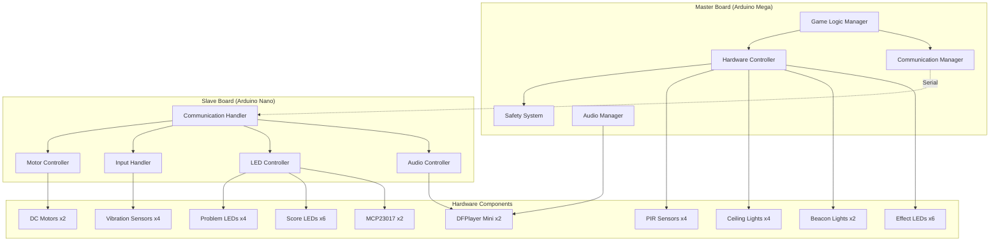

# 무궁화 게임 시스템 개발자 가이드

## 📁 프로젝트 구조

```
mugunghwa-game/
├── .kiro/                          # Kiro AI 설정
│   ├── specs/                      # 프로젝트 스펙
│   └── steering/                   # AI 가이드라인
├── .pio/                           # PlatformIO 빌드 파일
├── .vscode/                        # VS Code 설정
├── include/                        # 헤더 파일
│   ├── communication.h             # 통신 프로토콜 정의
│   ├── master_config.h             # Master 보드 설정
│   └── slave_config.h              # Slave 보드 설정
├── src/                            # 소스 코드
│   ├── master/                     # Master 보드 코드
│   │   └── main.cpp                # Master 메인 로직
│   └── slave/                      # Slave 보드 코드
│       └── main.cpp                # Slave 메인 로직
├── test/                           # 테스트 파일
├── docs/                           # 문서
├── platformio.ini                  # PlatformIO 설정
└── README.md                       # 프로젝트 개요
```

## 🏗️ 시스템 아키텍처

### 하드웨어 아키텍처



### 소프트웨어 아키텍처

#### Master Board 모듈 구조
```cpp
namespace Master {
    // 게임 로직 관리
    class GameLogicManager {
        GameState gameState;
        void updateGameState();
        void handlePhaseTransition();
        bool validateGameState();
    };
    
    // 하드웨어 제어
    class HardwareController {
        void controlLEDs(uint8_t pattern);
        void controlBeacons(bool green, bool red);
        void readPIRSensors();
    };
    
    // 통신 관리
    class CommManager {
        bool sendCommand(uint8_t cmd, uint8_t data1, uint8_t data2);
        bool receiveMessage(SerialMessage* msg);
        void monitorReliability();
    };
    
    // 안전 시스템
    class SafetySystem {
        void monitorHardware();
        void handleEmergency();
        void validateOperations();
    };
}
```

#### Slave Board 모듈 구조
```cpp
namespace Slave {
    // 모터 제어
    class MotorController {
        bool rotateHead(bool forward);
        bool rotateBody(bool forward);
        void emergencyStop();
        bool checkLimitSwitches();
    };
    
    // 입력 처리
    class InputHandler {
        uint8_t detectFloorPad();
        void processVibrationSensors();
        void validateInputSequence();
    };
    
    // LED 제어
    class LEDController {
        void showPattern(const LEDPattern& pattern);
        void updateScoreLEDs(uint8_t score);
        void controlMCP23017(uint8_t addr, uint8_t reg, uint8_t value);
    };
    
    // 통신 처리
    class CommHandler {
        void processMasterCommand();
        void sendResponse(uint8_t response);
        void handleCommError();
    };
}
```

## 🔧 개발 환경 설정

### 필수 도구
- **PlatformIO**: Arduino 개발 환경
- **VS Code**: 통합 개발 환경
- **Git**: 버전 관리
- **Serial Monitor**: 디버깅 도구

### 개발 환경 구축
```bash
# 1. PlatformIO 설치
pip install platformio

# 2. 프로젝트 클론
git clone [repository-url]
cd mugunghwa-game

# 3. 의존성 설치
pio lib install

# 4. 빌드
pio run

# 5. 업로드 (Master)
pio run -e master -t upload

# 6. 업로드 (Slave)  
pio run -e slave -t upload
```

### PlatformIO 설정 (platformio.ini)
```ini
[platformio]
default_envs = master, slave

[env:master]
platform = atmelavr
board = megaatmega2560
framework = arduino
monitor_speed = 9600
lib_deps = 
    SoftwareSerial

[env:slave]
platform = atmelavr
board = nanoatmega328
framework = arduino
monitor_speed = 9600
lib_deps = 
    Wire
    SoftwareSerial
```

## 📡 통신 프로토콜

### 메시지 구조
```cpp
struct SerialMessage {
    uint8_t header;      // 0xAA (고정)
    uint8_t command;     // 명령어 코드
    uint8_t data1;       // 데이터 1
    uint8_t data2;       // 데이터 2
    uint8_t checksum;    // XOR 체크섬
};
```

### 명령어 정의
```cpp
// Master → Slave 명령어
#define CMD_ROBOT_HEAD_FRONT    0x10    // 로봇 HEAD 정면 회전
#define CMD_ROBOT_HEAD_BACK     0x11    // 로봇 HEAD 후면 회전
#define CMD_ROBOT_BODY_FRONT    0x12    // 로봇 BODY 정면 회전
#define CMD_ROBOT_BODY_BACK     0x13    // 로봇 BODY 후면 회전
#define CMD_ROBOT_STOP          0x14    // 모든 모터 정지

#define CMD_SHOW_PATTERN        0x20    // LED 패턴 표시
#define CMD_CLEAR_PATTERN       0x21    // LED 패턴 지우기
#define CMD_UPDATE_SCORE        0x22    // 점수 LED 업데이트

#define CMD_PLAY_EFFECT         0x30    // 효과음 재생
#define CMD_STOP_AUDIO          0x31    // 오디오 정지

#define CMD_GET_STATUS          0x40    // 상태 요청
#define CMD_GET_INPUT           0x41    // 입력 상태 요청
#define CMD_GET_LIMIT           0x42    // 리미트 스위치 상태 요청

#define CMD_RESET               0xF0    // 시스템 리셋
#define CMD_STOP_ALL            0xFF    // 모든 동작 정지

// Slave → Master 응답
#define RESP_OK                 0x01    // 정상 처리
#define RESP_ERROR              0x02    // 오류 발생
#define RESP_ROBOT_READY        0x03    // 로봇 준비 완료
#define RESP_PATTERN_DONE       0x04    // 패턴 표시 완료
#define RESP_INPUT_CORRECT      0x05    // 입력 정답
#define RESP_INPUT_WRONG        0x06    // 입력 오답
#define RESP_LIMIT_REACHED      0x07    // 리미트 스위치 도달
#define RESP_UNKNOWN            0xFF    // 알 수 없는 명령
```

### 통신 구현 예제
```cpp
// Master에서 명령 전송
bool sendCommandToSlave(uint8_t cmd, uint8_t data1, uint8_t data2) {
    uint8_t checksum = cmd ^ data1 ^ data2;
    
    Serial.write(0xAA);      // 헤더
    Serial.write(cmd);       // 명령어
    Serial.write(data1);     // 데이터 1
    Serial.write(data2);     // 데이터 2
    Serial.write(checksum);  // 체크섬
    
    return waitForResponse();
}

// Slave에서 응답 전송
void sendResponseToMaster(uint8_t response) {
    uint8_t checksum = response;
    
    Serial.write(0xAA);      // 헤더
    Serial.write(response);  // 응답 코드
    Serial.write(0x00);      // 예약
    Serial.write(0x00);      // 예약
    Serial.write(checksum);  // 체크섬
}
```

## 🎮 게임 로직 구현

### 게임 상태 머신
```cpp
enum GamePhase {
    PHASE_IDLE = 0,              // 대기 상태
    PHASE_GAME_START,            // 게임 시작
    PHASE_ROBOT_TURN_FRONT,      // 로봇 정면 회전
    PHASE_NARRATION,             // 내레이션 재생
    PHASE_ROBOT_TURN_BACK,       // 로봇 후면 회전
    PHASE_SHOW_PATTERN,          // 패턴 표시
    PHASE_PLAYER_INPUT,          // 플레이어 입력 대기
    PHASE_MOTION_DETECT,         // 동작 감지
    PHASE_SCORE_UPDATE,          // 점수 업데이트
    PHASE_GAME_CLEAR             // 게임 클리어
};

struct GameState {
    uint8_t currentLevel;        // 현재 레벨 (1-11)
    uint8_t currentScore;        // 현재 점수 (0-7)
    GamePhase gamePhase;         // 게임 단계
    bool isGameActive;           // 게임 활성 상태
    bool isRobotFacing;          // 로봇이 정면을 보고 있는지
    unsigned long phaseTimer;    // 단계별 타이머
    bool motionDetected;         // 동작 감지 결과
} __attribute__((packed));
```

### 레벨별 난이도 설정
```cpp
struct LevelConfig {
    uint8_t patternLength;       // 패턴 길이
    uint16_t displayInterval;    // 표시 간격 (ms)
    uint16_t inputTimeout;       // 입력 제한 시간 (ms)
};

const LevelConfig LEVEL_CONFIGS[] PROGMEM = {
    {2, 500, 10000},  // 레벨 1
    {3, 500, 10000},  // 레벨 2
    {4, 500, 10000},  // 레벨 3
    {5, 500, 10000},  // 레벨 4
    {5, 300, 10000},  // 레벨 5
    {5, 300, 10000},  // 레벨 6
    {5, 300, 10000},  // 레벨 7
    {5, 300, 10000},  // 레벨 8
    {5, 300, 10000},  // 레벨 9
    {5, 300, 10000},  // 레벨 10
    {6, 300, 10000}   // 레벨 11
};
```

### LED 패턴 생성
```cpp
struct LEDPattern {
    uint8_t sequence[6];         // LED 점멸 순서
    uint8_t length;              // 패턴 길이
    uint16_t interval;           // 점멸 간격 (ms)
};

LEDPattern generateLevelPattern(uint8_t level) {
    LEDPattern pattern;
    LevelConfig config = getLevelConfig(level);
    
    pattern.length = config.patternLength;
    pattern.interval = config.displayInterval;
    
    // 연속 LED 방지 로직
    uint8_t lastLED = 255;  // 초기값 (없음)
    
    for (uint8_t i = 0; i < pattern.length; i++) {
        uint8_t newLED;
        do {
            newLED = random(0, 4);  // 0-3 범위
        } while (newLED == lastLED && pattern.length > 1);
        
        pattern.sequence[i] = newLED;
        lastLED = newLED;
    }
    
    return pattern;
}
```

## 🛡️ 안전장치 시스템

### 통신 안정성
```cpp
struct CommReliability {
    uint8_t retryCount;              // 재시도 횟수
    uint8_t maxRetries;              // 최대 재시도
    unsigned long lastSuccessTime;   // 마지막 성공 시간
    uint8_t consecutiveErrors;       // 연속 오류 횟수
    uint8_t errorThreshold;          // 오류 임계값
    bool isRecovering;               // 복구 모드 여부
    uint32_t totalCommAttempts;      // 총 통신 시도
    uint32_t successfulComms;        // 성공한 통신
    float communicationQuality;      // 통신 품질 (0-100%)
};

void monitorCommReliability() {
    unsigned long currentTime = millis();
    
    // 통신 품질 계산
    if (commReliability.totalCommAttempts > 0) {
        commReliability.communicationQuality = 
            (float)commReliability.successfulComms / 
            commReliability.totalCommAttempts * 100.0f;
    }
    
    // 연결 상태 확인
    if (currentTime - commReliability.lastSuccessTime > COMM_TIMEOUT) {
        handleCommTimeout();
    }
    
    // 복구 모드 처리
    if (commReliability.isRecovering) {
        processCommRecovery();
    }
}
```

### 하드웨어 안전장치
```cpp
struct HardwareSafety {
    bool motorOverloadProtection;    // 모터 과부하 보호
    bool sensorMalfunctionDetection; // 센서 오작동 감지
    bool powerStabilityMonitoring;   // 전원 안정성 모니터링
    bool emergencyStopActive;        // 비상 정지 활성
    float systemVoltage;             // 시스템 전압
    float systemTemperature;         // 시스템 온도
    uint16_t totalSystemErrors;      // 총 시스템 오류
};

void monitorHardwareSafety() {
    // 전압 모니터링
    monitorSystemVoltage();
    
    // 온도 모니터링  
    monitorSystemTemperature();
    
    // 모터 과부하 감지
    checkMotorOverload();
    
    // 센서 상태 확인
    validateSensorHealth();
    
    // 비상 상황 처리
    if (hardwareSafety.emergencyStopActive) {
        handleEmergencyStop();
    }
}
```

## 🧪 테스트 및 디버깅

### 단위 테스트
```cpp
// LED 제어 테스트
void testLEDControl() {
    Serial.println("=== LED 제어 테스트 ===");
    
    // 개별 LED 테스트
    for (int i = 0; i < 4; i++) {
        controlCeilingLight(i, true);
        delay(500);
        controlCeilingLight(i, false);
        delay(200);
    }
    
    // 패턴 테스트
    uint8_t testPattern[] = {0, 1, 2, 3};
    LEDPattern pattern = {testPattern, 4, 300};
    showLEDPattern(pattern);
    
    Serial.println("LED 제어 테스트 완료");
}

// 통신 테스트
void testCommunication() {
    Serial.println("=== 통신 테스트 ===");
    
    // 핑 테스트
    bool success = sendCommandToSlave(CMD_GET_STATUS, 0, 0);
    Serial.print("핑 테스트: ");
    Serial.println(success ? "성공" : "실패");
    
    // 지연 시간 측정
    unsigned long startTime = millis();
    sendCommandToSlave(CMD_GET_STATUS, 0, 0);
    unsigned long latency = millis() - startTime;
    Serial.print("통신 지연: ");
    Serial.print(latency);
    Serial.println("ms");
    
    Serial.println("통신 테스트 완료");
}
```

### 디버깅 도구
```cpp
// 메모리 사용량 출력
void printMemoryUsage() {
    extern int __heap_start, *__brkval;
    int v;
    int freeMemory = (int) &v - (__brkval == 0 ? (int) &__heap_start : (int) __brkval);
    
    Serial.print("여유 메모리: ");
    Serial.print(freeMemory);
    Serial.println(" bytes");
}

// 시스템 상태 출력
void printSystemStatus() {
    Serial.println("=== 시스템 상태 ===");
    Serial.print("게임 단계: ");
    Serial.println(getPhaseNameKorean(gameState.gamePhase));
    Serial.print("현재 레벨: ");
    Serial.println(gameState.currentLevel);
    Serial.print("현재 점수: ");
    Serial.println(gameState.currentScore);
    Serial.print("게임 활성: ");
    Serial.println(gameState.isGameActive ? "예" : "아니오");
    
    printMemoryUsage();
    Serial.println("==================");
}

// 성능 프로파일링
void profileFunction(void (*func)(), const char* name) {
    unsigned long startTime = micros();
    func();
    unsigned long endTime = micros();
    
    Serial.print(name);
    Serial.print(" 실행 시간: ");
    Serial.print(endTime - startTime);
    Serial.println(" μs");
}
```

## 📝 코딩 표준

### 네이밍 컨벤션
```cpp
// 상수: UPPER_SNAKE_CASE
#define MAX_RETRY_COUNT         5
#define COMM_TIMEOUT_MS         1000

// 변수: camelCase
uint8_t currentLevel;
bool isGameActive;
unsigned long lastUpdateTime;

// 함수: camelCase
void updateGameState();
bool sendCommandToSlave();
uint8_t calculateChecksum();

// 구조체/클래스: PascalCase
struct GameState;
class CommManager;
enum GamePhase;

// 매크로 함수: UPPER_SNAKE_CASE
#define CLAMP(x, min, max) ((x) < (min) ? (min) : ((x) > (max) ? (max) : (x)))
```

### 주석 규칙
```cpp
/**
 * @brief 게임 상태를 업데이트합니다
 * @param deltaTime 이전 업데이트로부터 경과 시간 (ms)
 * @return 업데이트 성공 여부
 * @note 메인 루프에서 주기적으로 호출되어야 합니다
 * @warning deltaTime이 0이면 안전하지 않을 수 있습니다
 */
bool updateGameState(uint32_t deltaTime) {
    // 입력 검증
    if (deltaTime == 0) {
        Serial.println("경고: deltaTime이 0입니다");
        return false;
    }
    
    // 게임 상태에 따른 처리
    switch (gameState.gamePhase) {
        case PHASE_IDLE:
            // 대기 상태 처리
            handleIdlePhase();
            break;
            
        case PHASE_GAME_START:
            // 게임 시작 처리
            handleGameStartPhase();
            break;
            
        default:
            // 알 수 없는 상태
            Serial.print("알 수 없는 게임 단계: ");
            Serial.println(gameState.gamePhase);
            return false;
    }
    
    return true;
}
```

### 에러 처리
```cpp
// 에러 코드 정의
enum ErrorCode {
    ERROR_NONE = 0,
    ERROR_INVALID_PARAMETER,
    ERROR_COMMUNICATION_FAILED,
    ERROR_HARDWARE_MALFUNCTION,
    ERROR_MEMORY_INSUFFICIENT,
    ERROR_TIMEOUT,
    ERROR_UNKNOWN
};

// 에러 처리 함수
ErrorCode handleError(ErrorCode error, const char* context) {
    Serial.print("오류 발생 [");
    Serial.print(context);
    Serial.print("]: ");
    
    switch (error) {
        case ERROR_INVALID_PARAMETER:
            Serial.println("잘못된 매개변수");
            break;
        case ERROR_COMMUNICATION_FAILED:
            Serial.println("통신 실패");
            startCommRecovery();
            break;
        case ERROR_HARDWARE_MALFUNCTION:
            Serial.println("하드웨어 오작동");
            enterSafeMode();
            break;
        default:
            Serial.println("알 수 없는 오류");
            break;
    }
    
    return error;
}

// 안전한 함수 호출
#define SAFE_CALL(func, context) do { \
    ErrorCode result = func; \
    if (result != ERROR_NONE) { \
        handleError(result, context); \
    } \
} while(0)
```

## 🚀 배포 및 업데이트

### 빌드 프로세스
```bash
# 1. 코드 검증
pio check

# 2. 테스트 실행
pio test

# 3. 릴리스 빌드
pio run -e master --target clean
pio run -e master
pio run -e slave --target clean  
pio run -e slave

# 4. 펌웨어 백업
cp .pio/build/master/firmware.hex backup/master_v1.0.hex
cp .pio/build/slave/firmware.hex backup/slave_v1.0.hex
```

### 업데이트 절차
1. **사전 준비**
   - 현재 펌웨어 백업
   - 시스템 상태 확인
   - 업데이트 계획 수립

2. **업데이트 실행**
   ```bash
   # Master 업데이트
   pio run -e master -t upload
   
   # Slave 업데이트  
   pio run -e slave -t upload
   ```

3. **사후 검증**
   - 시스템 초기화 확인
   - 기능 테스트 실행
   - 성능 검증

### 버전 관리
```cpp
// version.h
#define FIRMWARE_VERSION_MAJOR  1
#define FIRMWARE_VERSION_MINOR  0
#define FIRMWARE_VERSION_PATCH  0
#define FIRMWARE_BUILD_DATE     __DATE__
#define FIRMWARE_BUILD_TIME     __TIME__

void printVersionInfo() {
    Serial.print("펌웨어 버전: ");
    Serial.print(FIRMWARE_VERSION_MAJOR);
    Serial.print(".");
    Serial.print(FIRMWARE_VERSION_MINOR);
    Serial.print(".");
    Serial.println(FIRMWARE_VERSION_PATCH);
    Serial.print("빌드 일시: ");
    Serial.print(FIRMWARE_BUILD_DATE);
    Serial.print(" ");
    Serial.println(FIRMWARE_BUILD_TIME);
}
```

## 📚 참고 자료

### 공식 문서
- [Arduino Reference](https://www.arduino.cc/reference/)
- [PlatformIO Documentation](https://docs.platformio.org/)
- [AVR Libc Reference](https://www.nongnu.org/avr-libc/)

### 하드웨어 데이터시트
- [Arduino Mega 2560](https://docs.arduino.cc/hardware/mega-2560)
- [Arduino Nano](https://docs.arduino.cc/hardware/nano)
- [MCP23017 I/O Expander](https://ww1.microchip.com/downloads/en/devicedoc/20001952c.pdf)
- [L298N Motor Driver](https://www.st.com/resource/en/datasheet/l298.pdf)
- [DFPlayer Mini](https://wiki.dfrobot.com/DFPlayer_Mini_SKU_DFR0299)

### 개발 도구
- [VS Code](https://code.visualstudio.com/)
- [PlatformIO IDE](https://platformio.org/platformio-ide)
- [Serial Monitor Tools](https://platformio.org/docs/core/userguide/device/cmd_monitor.html)

---

**버전**: 1.0  
**최종 업데이트**: 2025년 8월 31일  
**작성자**: 무궁화 게임 시스템 개발팀